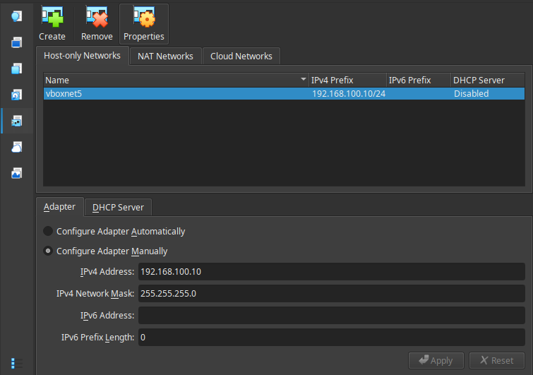

# CSV - NPE

## Pre-requirements

1. Download and unzip the files directory.

- [Download link](https://hogent-my.sharepoint.com/:u:/r/personal/tuur_lammens2_student_hogent_be/Documents/lessen/csv/PVE%20taak/files.tar.gz?csf=1&web=1&e=wfjfqP)
- This contains the Papercut NG 19.2.7 install script and a lightly modified vdi drive.
- The vdi drive had network adapters configured. That is everything. ip is `192.168.100.50`

2. Place the files directory in the root of this directory so it looks like the following:

```txt
.
├── files/
│   ├── CSV_Kali_Demo.vdi
│   ├── CSV_PaperCut_Exploit_Demo.vdi
│   └── pcng-setup-19.2.6.9220-linux-x64.sh
├── static/
├── README.md
└── install.sh
```

3. Make sure that the host-only network of `192.168.100.0/24` already exists in virtualbox gui

- 
- You can keep adding new ones until you reach number 5.
- The set ip does not matter, the script automatically changes this.
- **But the network itself should exist!**

4. If everything is configured correctly, you can run `./install-ubuntu.sh && ./install-kali.sh`.
5. After the configuration of the Ubuntu server is complete, open the [web ui](http://192.168.100.50:9191/) and initialize the admin account.
6. Run the Ubuntu provisioning script again to add the dummy printers. `./install-ubuntu.sh`

- If anything goes wrong during provisioning, it is good practace to stop and remove the VM.
  - The provisioning part is skipped if there is a VM with the same name.

## Exploit

### Phase 1: Provisioning

1. Open the Kali VM GUI and log in with username `kali` and password `kali`.
2. Open the terminal and execute the exploit script with `./pwn_everything`.
3. The script will execute everything and open a tmux session. The bottom-left pane shows papercut user access, the bottom-right pane shows the root user access.

- You will initially only see papercut user access. Root acces will be granted after a system reboot. This cannot be done from the papercut user.
- In a real-world scenario, you would just wait (to our knowledge). But for this demo you can ssh into the Ubuntu vm, from your host or from the Kali vm, with `ssh osboxes@192.168.100.50` and use the password `osboxes.org` and use `sudo reboot`.
- The shutdown can take a while.

## Vulnerability Profile

| Attribute | Details |
| :--- | :--- |
| **CVSS 3.0 Score** | **9.8 (CRITICAL)** |
| **Vector String** | `CVSS:3.0/AV:N/AC:L/PR:N/UI:N/S:U/C:H/I:H/A:H` |
| **CWE ID** | **CWE-284**: Improper Access Control |
| **Affected Versions** | PaperCut NG/MF version **22.0.5 (Build 63914)** and earlier |
| **Exploitation Status** | **Active**: Listed in the CISA Known Exploited Vulnerabilities (KEV) catalog |

## Impact

Various threat actors, including ransomware groups and state-sponsored entities, heavily target this vulnerability. 

* **Zero-Day Use:** The flaw was first found and exploited before many organizations could implement a patch.
* **Automation:** Since the exploit does not require user interaction and can be activated over the network, attackers have used automated scanners to detect and compromise vulnerable servers worldwide.

## Mitigation

Upgrade PaperCut to a patched version (**20.1.7 (or newer)**). If immediate patching is not feasible, organizations should limit network access to the PaperCut management web interface (ports 9191 and 9192) to prevent it from being reachable from the public internet.

## Links

- [Osboxes ubuntu server](https://www.osboxes.org/ubuntu-server/)
- [papercut older releases](https://www.papercut.com/kb/Main/PastVersions/)
- [Papercut NG 19.2.7 mirror](https://cdn.papercut.com/web/products/ng-mf/installers/ng/19.x/pcng-setup-19.2.7.62200.sh)
- [horizon3ai/CVE-2023-27350 - github with exploit script](https://github.com/horizon3ai/CVE-2023-27350?tab=readme-ov-file)
